# ST7735 TFT LCD & STM32F1xx Import External Fonts.
ST3375 w/ stm32f1xx Now can import external font format by MicroElectronica GLCD Fonts Creator.  
Base on this project : https://github.com/ScarsFun/STM32F103C8T6_cubeIDE_ST7735_1.8_DMA

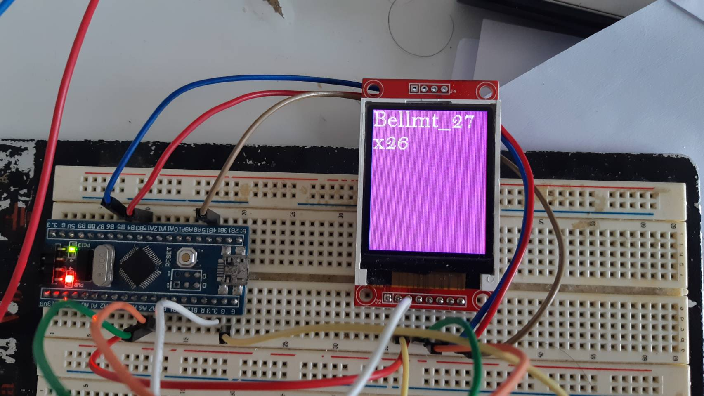   
How to make a font?
   
1. Download MicroElectronica GLCD Fonts Creator From this link : https://www.mikroe.com/glcd-font-creator
   
2. Click "File" >> "New Font" >> "Import An Existing System Font"

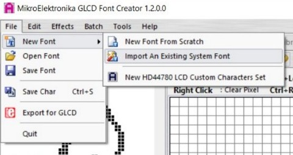 
And then Config a Font, Font style and Size that you prefer. Click "OK" and wait a program to generate a GLCD code.

  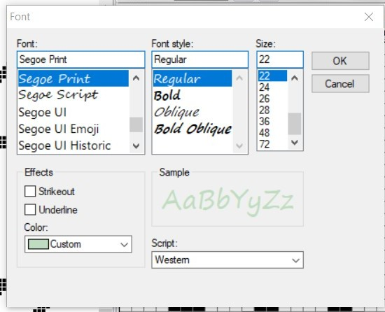 
  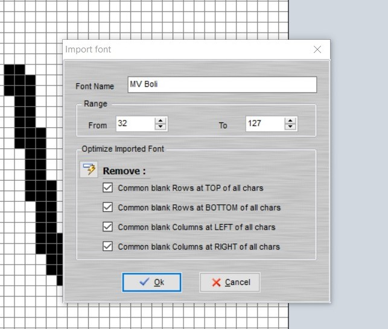

3.Click "Export for TFT and new GLCD(new library)" >> "mikroC".

4.Create a 'static const uint16_t' array type in fonts.c file and fill array with a font data.

  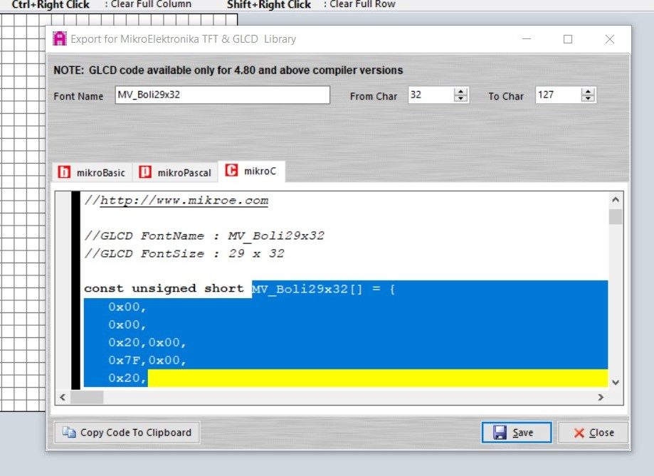
  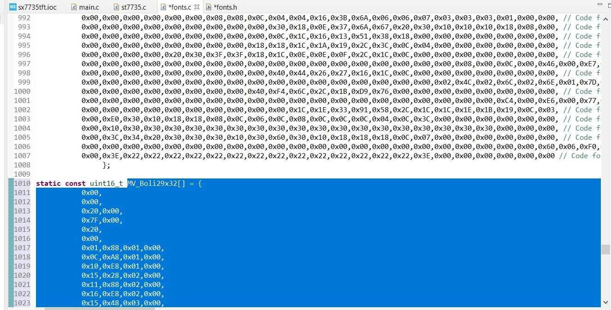

Define a FontDef looks like in a below image at a bottom of file.

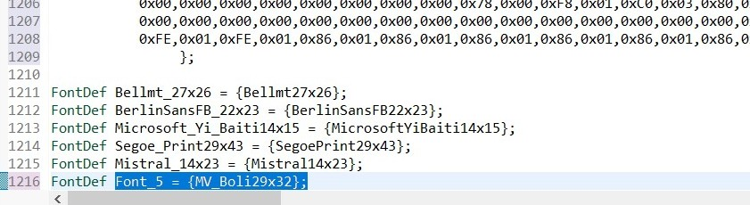
And then open a fonts.h and Define a data looks like in a below image.

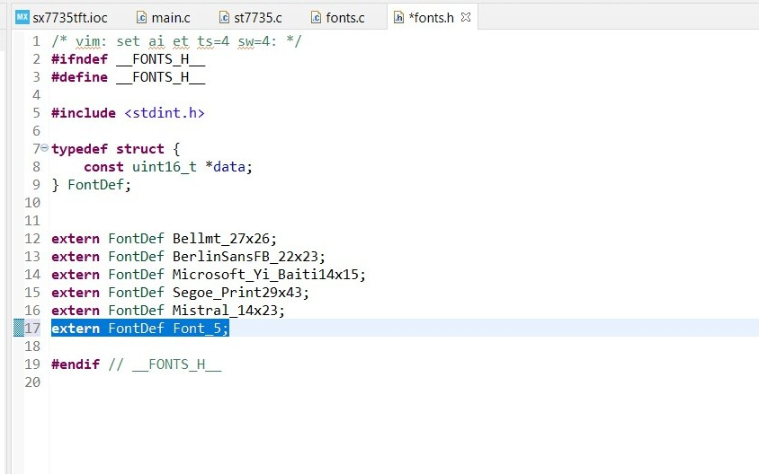

Now you can use Fonts that you have imported.

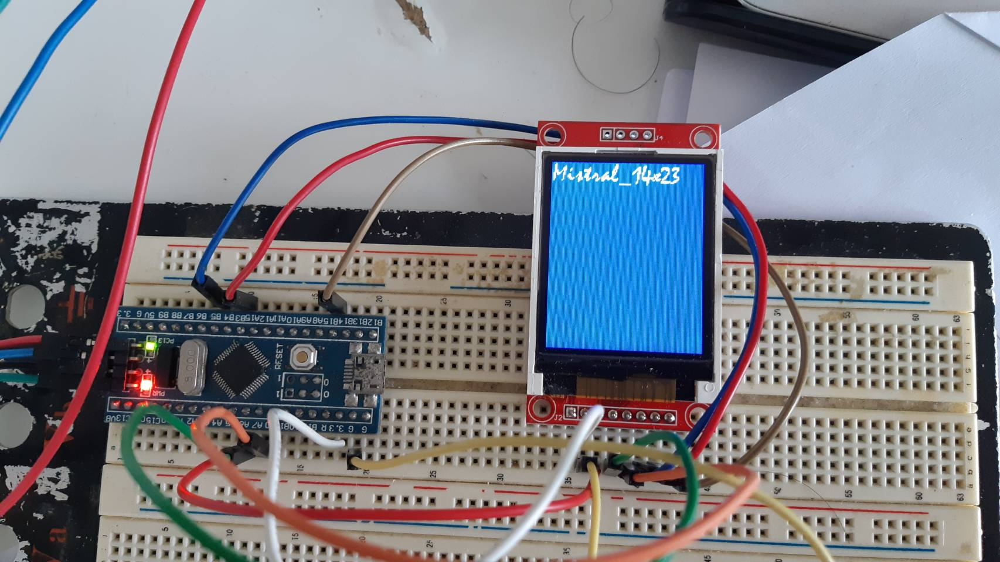
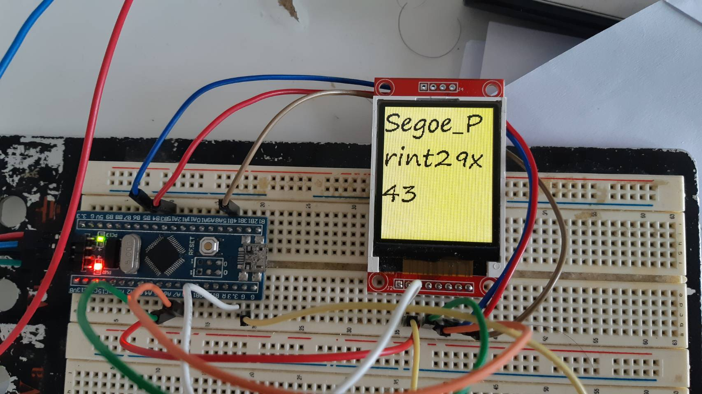
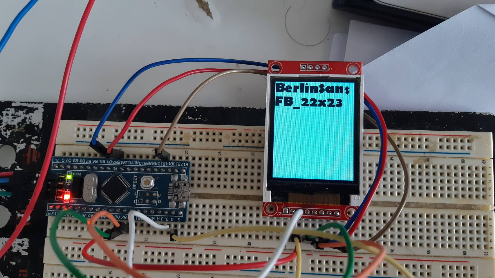

